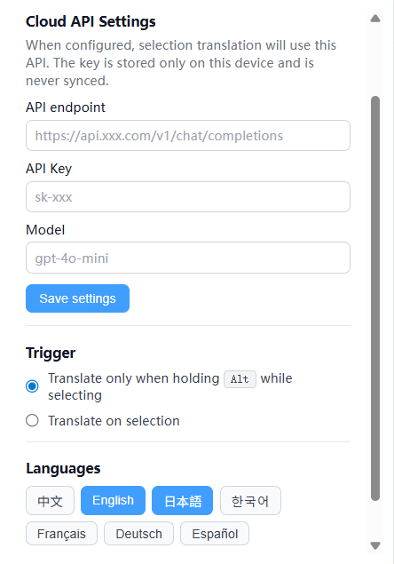
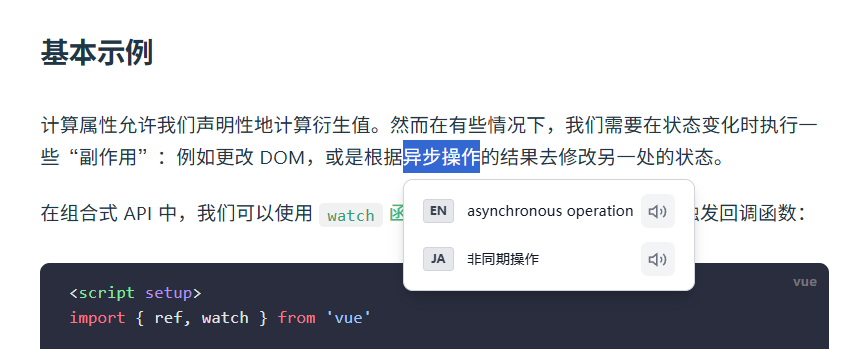

## Multi-Language Selection Translator

> English version below.

一个简单的小插件，在网页上划一下词，就能同时看到多种语言的翻译结果。

### 截图

Popup 设置界面（选择语言、触发方式和云端 API）：



网页中划词后出现的浮动翻译卡片：



### 功能简介

- **一键多语言翻译**：选中一段文本，会按照你在设置里勾选的语言，依次给出翻译。
- **触发方式可选**：
  - 只在按住 `Alt` 再划词时触发；
  - 或者只要选中文本就自动弹出翻译。
- **自定义云端 API**：
  - 在弹窗里填自己的 Chat/LLM 接口（只要兼容 OpenAI `chat/completions` 风格即可）。
  - 支持自己配 Endpoint、API Key 和模型名。
  - 这些配置都放在本地浏览器的 storage 里，不会同步、不上传。
- **不打扰页面的 UI**：
  - 设置页（弹窗）用 Vue 3 写的，比较直观。
  - 翻译结果以一个小浮层贴在选中文本附近，不会改动原页面结构。

### 技术栈

- **运行环境**：Chrome / Edge 等 Chromium 浏览器，Manifest V3。
- **框架**：Vue 3 + TypeScript。
- **构建**：Vite + `@crxjs/vite-plugin`。
- **数据存储**：
  - `chrome.storage.sync`：记住你勾选了哪些语言、触发方式等。
  - `chrome.storage.local`：放云端 API 的地址、Key 和模型名。

### 主要目录结构（源码相关）

- `manifest.json`：扩展清单，声明 background、content_script、popup 等。
- `src/popup/`
  - `App.vue`：扩展弹窗主界面，用来：
    - 选中/取消目标语言；
    - 设置触发方式（Alt 划词 / 直接划词）；
    - 配置云端 API 的 Endpoint / Key / Model。
  - `main.ts`：挂载弹窗的入口。
  - `index.html`：弹窗页面的 HTML 模板。
- `src/background/index.ts`：
  - MV3 Service Worker。
  - 负责接收前台发来的 `TRANSLATE_TERM` 消息；
  - 从 storage 里读云端 API 配置；
  - 调用云端接口并解析成统一的 `TranslationResult`。
- `src/content_script/`
  - `index.ts`：内容脚本入口，监听用户划词、根据设置决定是否触发翻译，并挂载浮层。
  - `FloatingCard.vue`：真正显示翻译结果的浮动卡片组件。
  - `dualEngineTranslate.ts`：封装了一点“怎么跟 background 通信并让它去打云端”的小逻辑。
  - `speech.ts`：用 Web Speech API 做朗读按钮（如果浏览器支持的话）。
- `src/constants/`
  - `languages.ts`：支持的语言列表、默认选中项、短标签等。
  - `storageKeys.ts`：统一管理各个 storage key，避免写错字符串。
  - `prompts.ts`：给大模型用的 system prompt，根据当前勾选的语言拼出来。
- `src/types/translation.ts`：把前台/后台通信用到的几种类型集中放在一起（请求、响应、解析工具等）。

### 安装与本地开发

#### 1. 克隆代码并安装依赖

```bash
git clone <your-repo-url>
cd Multi-Language-Selection-Translator
npm install
```

#### 2. 构建扩展

开发调试一般直接用打包后的 `dist`：

```bash
npm run build
```

执行成功后会生成 `dist/` 目录，里面包含：

- 构建后的 `manifest.json`
- background / content_script / popup 等所有资源文件

#### 3. 在 Chrome 中加载

1. 打开 `chrome://extensions/`
2. 右上角打开「开发者模式」
3. 点击「加载已解压的扩展程序」
4. 选择项目下的 `dist/` 目录

加载成功后，工具栏会出现这个扩展的图标。

### 使用方式

1. **先配好云端 API**
   - 点击浏览器工具栏里的扩展图标，打开弹窗。
   - 在 **Cloud API Settings** 区域里填：
     - API endpoint，例如：`https://api.xxx.com/v1/chat/completions`
     - API Key，例如：`sk-xxx`
     - Model，例如：`gpt-4o-mini` 或其他兼容模型名
   - 点一下「Save settings」，等弹窗底部提示 saved 消失即可。

2. **选目标语言**
   - 在 **Languages** 区域点击按钮勾选/取消语言；
   - 有最大数量限制，多了会自动禁止继续选。

3. **选触发方式**
   - 在 **Trigger** 区域里二选一：
     - Alt + 划词 时才弹翻译；
     - 只要划词就自动弹翻译。

4. **实际在网页里用**
   - 打开任意网页；
   - 按你配置的方式选一段文本；
   - 如果云端 API 配置正常，几秒内会在选区附近出现一个小卡片，里面按语言一行行展示翻译结果。
   - 如果配置有问题或网络不通，会在卡片里看到对应的英文错误提示。

### 常用 npm 脚本

在项目根目录的 `package.json` 里可以看到这些脚本：

- `npm run dev`：本地起一个 Vite 开发服务，主要用来看 popup 页面和样式。
- `npm run build`：打包 MV3 扩展，输出到 `dist/`。
- `npm run preview`：预览打包好的页面（更多是页面调试用）。
- `npm run type-check`：跑一遍 TypeScript / Vue 的类型检查。

### 一些小提示

- **关于 API Key**  
  Key 只会保存在本地 `chrome.storage.local` 里，不会同步账户，也不会被代码里硬编码。提交代码时尽量别把真实 Key 写进仓库里。

- **扩展权限**  
  - `storage`：读写你的设置和云端 API 配置。
  - `<all_urls>` / `activeTab`：为了在你打开的网页上挂内容脚本并显示浮层。
  - 其它权限可以直接看 `manifest.json`，整体比较克制。

- **浏览器兼容**  
  主打 Chrome / Edge 的 MV3 环境，其它 Chromium 浏览器只要支持 MV3，一般也能用。


---

## Multi-Language Selection Translator (EN)

A small Chrome extension that translates selected text into multiple languages and shows the results in a floating card next to your selection.

### Screenshots

Popup settings (languages, trigger mode and cloud API):


Floating translation card on a web page:


### Features

- **Translate into multiple languages at once**  
  Select a piece of text and get translations in several languages that you picked in the settings.

- **Configurable trigger behavior**  
  - Only translate when you hold `Alt` while selecting text, or  
  - Translate automatically whenever some text is selected.

- **Custom cloud translation API**  
  - Configure your own OpenAI-compatible `chat/completions` style endpoint.  
  - Set endpoint URL, API key, and model name in the popup.  
  - All settings are stored locally in `chrome.storage` and never synced or uploaded.

- **Lightweight UI**  
  - A Vue 3–powered popup for configuration.  
  - A clean floating card rendered by the content script on top of any page, without changing the page layout.

### Tech stack

- **Runtime**: Chrome / Chromium extensions, Manifest V3  
- **Framework**: Vue 3 + TypeScript  
- **Build tools**: Vite + `@crxjs/vite-plugin`  
- **Storage**:
  - `chrome.storage.sync` for user preferences (languages, trigger mode)
  - `chrome.storage.local` for sensitive cloud API settings (endpoint / key / model)

### How it works (high level)

- **Popup (`src/popup`)**  
  - Lets you pick target languages, trigger mode, and cloud API settings.  
  - Persists everything to `chrome.storage`.

- **Content script (`src/content_script`)**  
  - Listens to text selection events on web pages.  
  - Decides whether to trigger translation based on your settings.  
  - Renders a Vue floating card component with the translation results.  
  - Optionally uses the Web Speech API to read the translations aloud.

- **Background service worker (`src/background/index.ts`)**  
  - Receives `TRANSLATE_TERM` messages from the content script.  
  - Reads the configured cloud API settings from storage.  
  - Calls the cloud model (OpenAI-compatible) and normalizes the response into a shared `TranslationResult` type.

### Install & run from source

```bash
git clone https://github.com/JoyForCoding/Multi-Language-Selection-Translator.git
cd Multi-Language-Selection-Translator
npm install
npm run build
```

Then load the `dist/` folder as an unpacked extension in `chrome://extensions` with Developer Mode enabled.

### License

MIT © JoyForCoding
